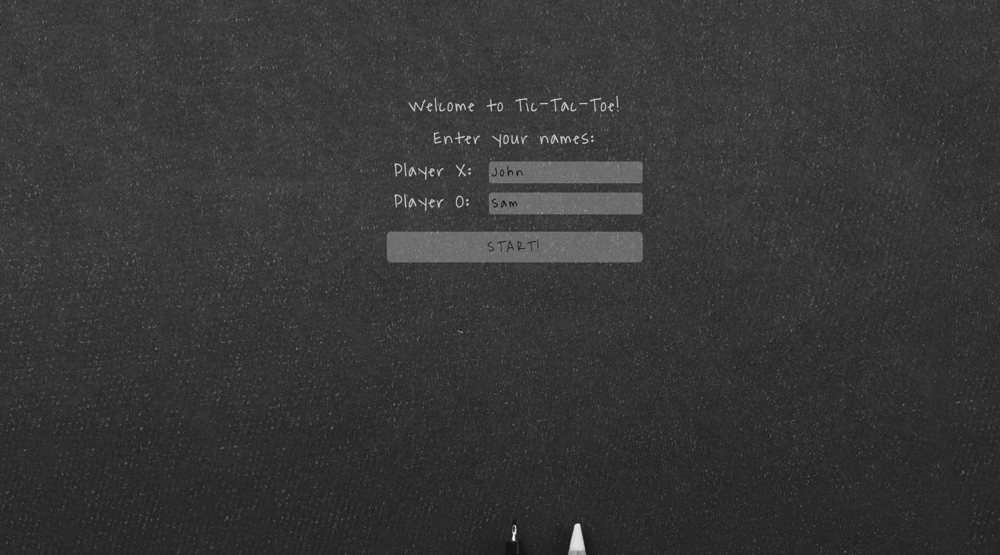
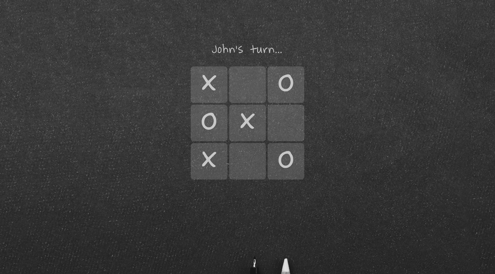

# Tic-Tac-Toe

This project is a part of the [Odin](https://www.theodinproject.com) curriculum on programming. This is a practical [task](https://www.theodinproject.com/lessons/node-path-javascript-tic-tac-toe) that implements Factory Functions and the Module Pattern topic.

The main goal of the task was to have as little global code as possible.

The game requires two players. The users must first enter their names and click the START button. The players mark the field one after another. When the winner or tie is determined, the game can be started again with the same players.

Live version can be found [here](https://mountainflockstictactoe.netlify.app).

## Technologies used: 

* JavaScript
* HTML
* CSS

## Display
 
 
